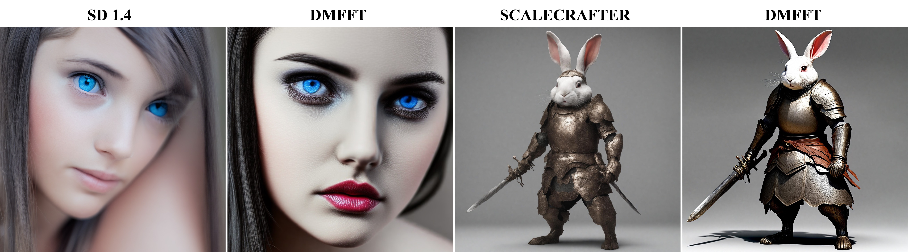
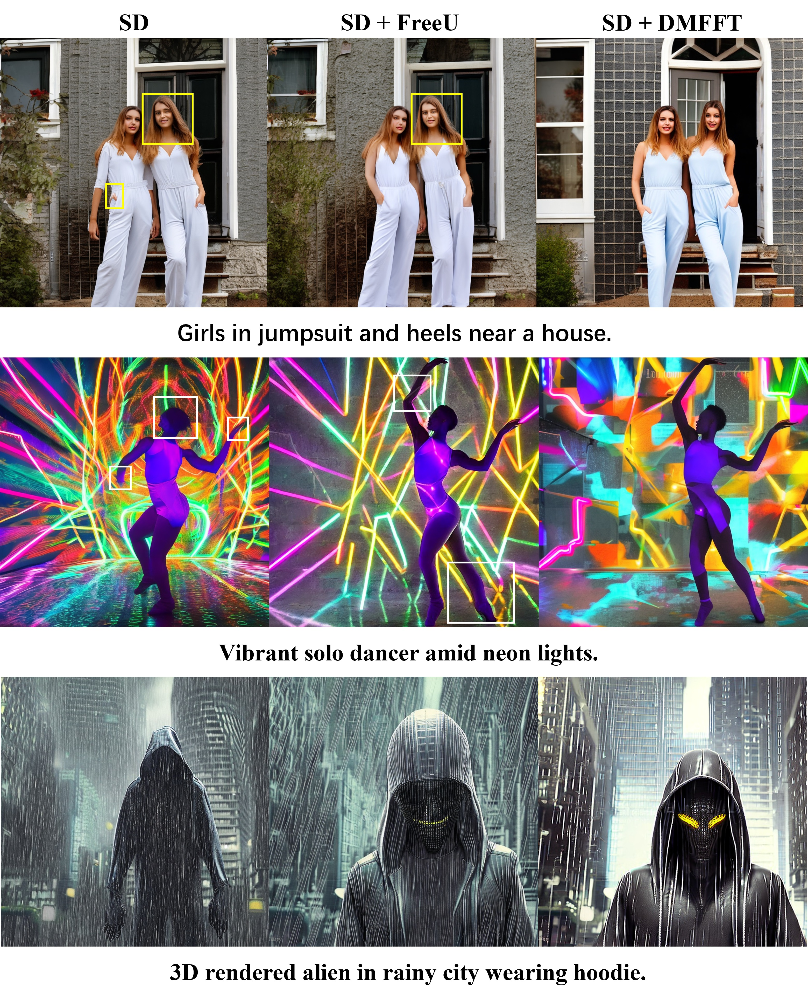
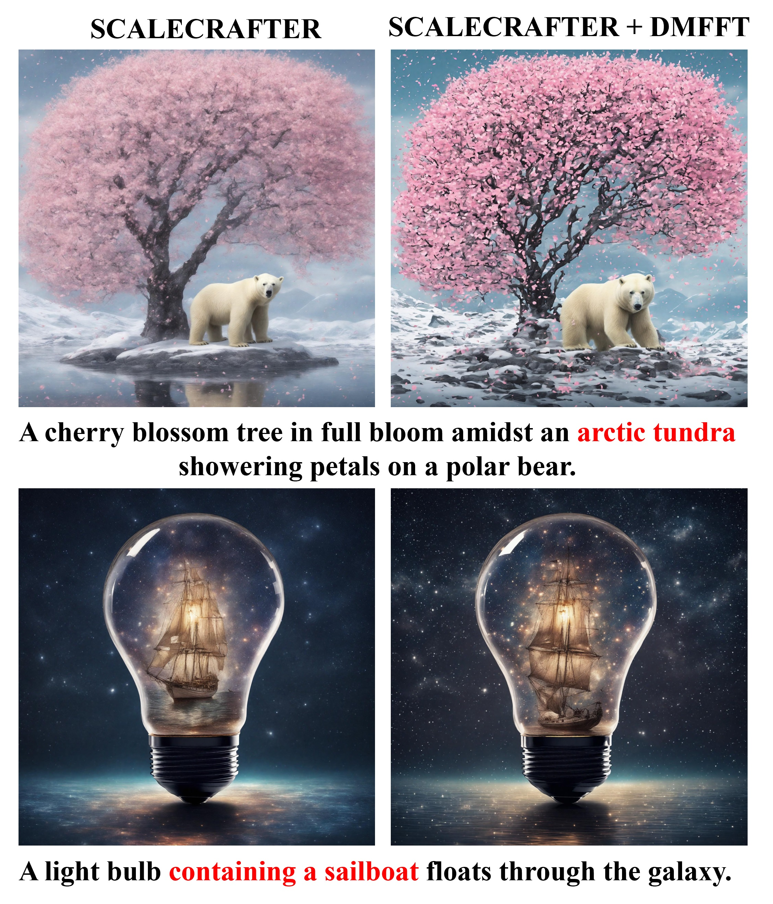
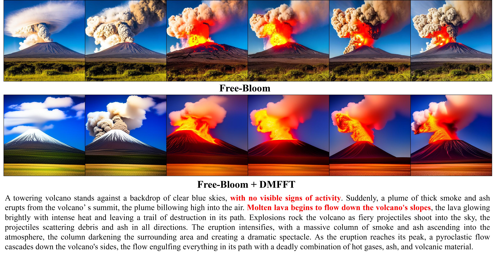

<h1>DMFFT: Improving the Generation Quality of Diffusion Models using Fast Fourier Transform</h1>
<h2>Cuihong Yu, Cheng Han, Chao Zhang</h2>

## Introduction
We built DMFFT, the framework of improving the generation quality of diffusion models using Fast Fourier Transform, as a step towards Universal Generative AI.
DMFFT can support text-to-image, text-to-video, and so on. DMFFT can be further extended to other applications such as art, film and television production, 3D modeling, and other fields. Future versions will support more modalities.

## Performance

## Usage
- [`python app.py`](./app.py)

## Data
The implementation of this study is based on the official published code for each comparison baseline and follows the data preprocessing strategy for each baseline (e.g., resolution, frame rate, and number of frames). The baselines include: SD 1.4, SCALECRAFTER, Free-Bloom, Text2Video-Zero and others.

## To Do List
We are now in the first phase of DMFFT, and we want to do further in-depth research in the future. In the future, we will make additional enhancements in the following categories:
- Supplementary materials
- Cross-domain extension
- Code optimization
- ......
